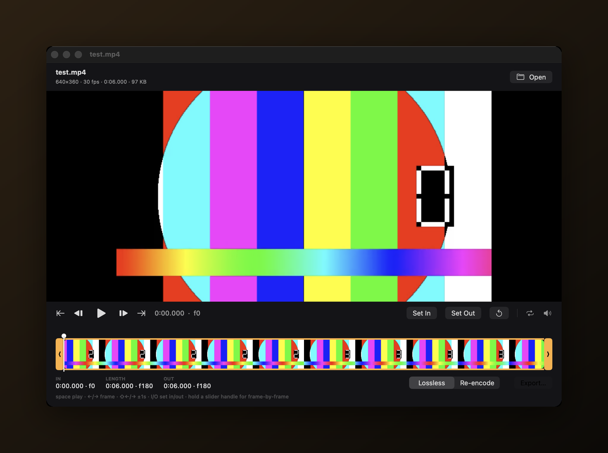

# Snip

Native macOS video trimmer — drag a video in, trim with frame-accurate sliders, preview from any point, export lossless or re-encoded.



## Download

**[⬇︎ Download for macOS](https://github.com/Alyetama/Snip/releases/latest/download/Snip.dmg)**

That link always points at the newest release, because the DMG filename carries no
version — see [Releases](https://github.com/Alyetama/Snip/releases) for the changelog.

## Features

- **Drag & drop** a video anywhere in the window (⌘O and Finder "Open With" work too)
- **Dual trim handles** over a thumbnail filmstrip timeline
- **Live preview** — click anywhere on the timeline and play from that exact point
- **Frame-by-frame precision** — hold a handle (or the playhead) still for half a second and every 8 px of drag moves exactly one frame
- **Keyboard-first**: `space` play/pause · `←`/`→` frame step · `⇧←`/`⇧→` ±1 s · `I`/`O` set in/out · `L` loop selection · `M` mute · `⌘E` export
- **Two export modes**: Lossless (instant passthrough, cuts snap to keyframes) or Re-encode (frame-exact), with a live output-size estimate
- **Safe exports** — written to a temp file and swapped in on success, so a failed export never destroys an existing file; overwriting the original is refused
- Frame *stepping* is always true-to-media; displayed frame numbers assume a constant frame rate, so they're approximate on VFR recordings

## First launch (opening an unsigned app)

**Snip isn't signed with an Apple Developer ID**, so macOS blocks it the
first time you open it. This is expected — you only need to do one of the
following once, and it opens normally afterward.

**1. Right-click to open.** In Finder, **Control-click** (or right-click)
`Snip`, choose **Open**, then click **Open** again in the dialog.

**2. If macOS still won't let you (newer versions):** open
**System Settings → Privacy & Security**, scroll down to the message about
`Snip` being blocked, and click **Open Anyway**. Confirm with
**Open Anyway** (and Touch ID or your password if asked).

**3. Terminal fallback.** If neither works, remove the quarantine flag and open
it normally:

```bash
/usr/bin/xattr -dr com.apple.quarantine /Applications/Snip.app
```

(Adjust the path if you keep the app somewhere other than `/Applications`.)

## Build from source

```bash
git clone https://github.com/Alyetama/Snip.git
cd Snip
./build_app.sh          # → build/Snip.app
```

Requires macOS 15+ and Xcode command line tools. Pure SwiftUI + AVFoundation, no dependencies.

## License

[MIT](LICENSE) © 2026 Alyetama
